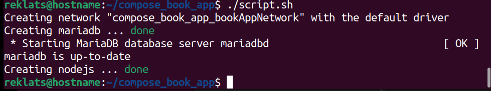
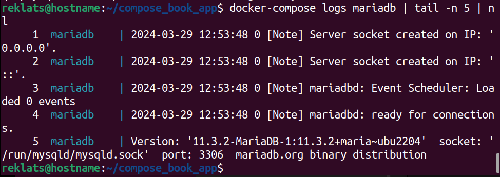
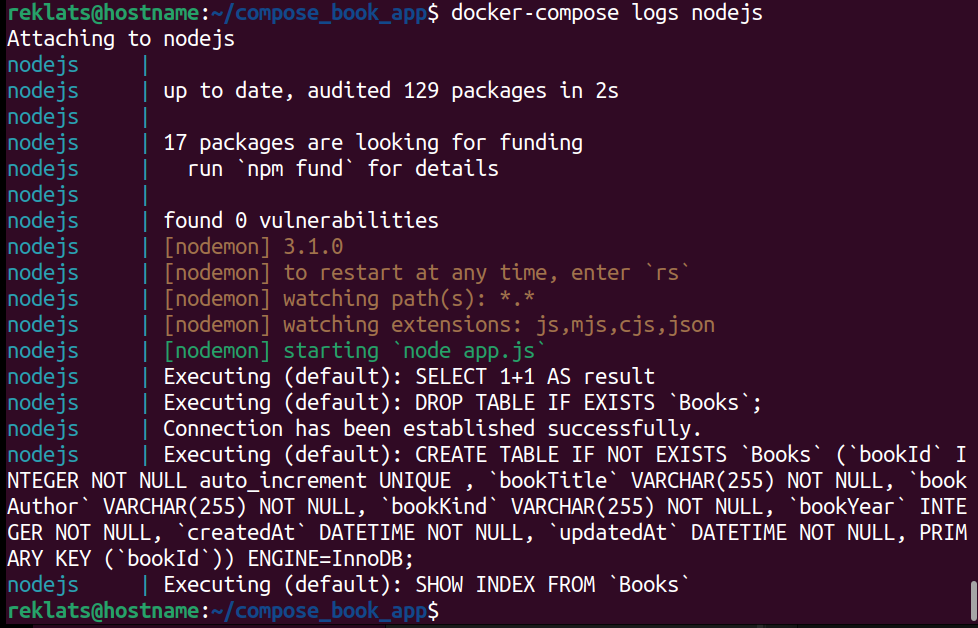
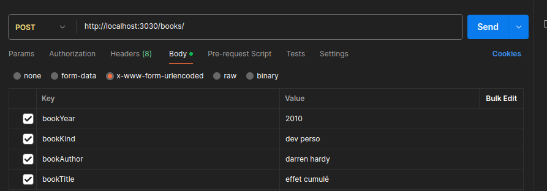

Il s'agit d'une application de gestion de livres et elle tournera sur le port 3030.

Pour pouvoir démarrer l'apllication il faut d'abord cloner le repo :
```
https://github.com/r10705T4/bookApp.git && cd bookApp
```
Après cela vous devez lancer docker compose en supposant qu'il est déjà installé.Si ce n'est pas le cas veuillez suivre les instructions de la documentation pour l'installation.

Pour lancer l'application vous avez deux options: manuellement ou automatiquement

**1-Manuellement**

Lancer les commandes suivantes 
```
docker-compose up -d mariadb 
docker exec -it mariadb /bin/sh -c "/etc/init.d/mariadb start"
docker-compose up -d nodejs
```
**2-Automatiquement**

Dans le répertoire courant(bookApp) il y a un script qui peut vous permettre de lancer directement l'application.
Ajouter les droits d'éxecution et lancer le script :
```
chmod +x script.sh && ./script.sh
```


Après avoir lancé l'application exécutez les deux commandes suivantes 
```
docker-compose logs nodejs
docker-compose logs mariadb | tail -n 5
```

Vous devrez avoir un resultat similaire sinon patientez un moment et relancez

Les logs de mariadb indiquant que ce dernier est actif



Les logs de nodejs indiquant qu'il est fonctionnel



Suite à ça vous pouvez effectuer les requêtes voulues

Les routes que vous pouvez interrroger sont :

http://localhost:3030/books (GET et POST)

http://localhost:3030/books/:bookId (GET, PUT, DELETE)


Pour les requêtes POST et PUT il faut utiliser les champs suivants 
bookAuthor
bookTitle
bookKind
bookYear

Voici un exemple d'utilisation dans Postman




Vous avez maintenant toutes les clés en main pour utiliser l'application.

Je n'ai pas pu implémenter les fonctionnalités de pagination, et d'interface utiisateur.

Merci

 
